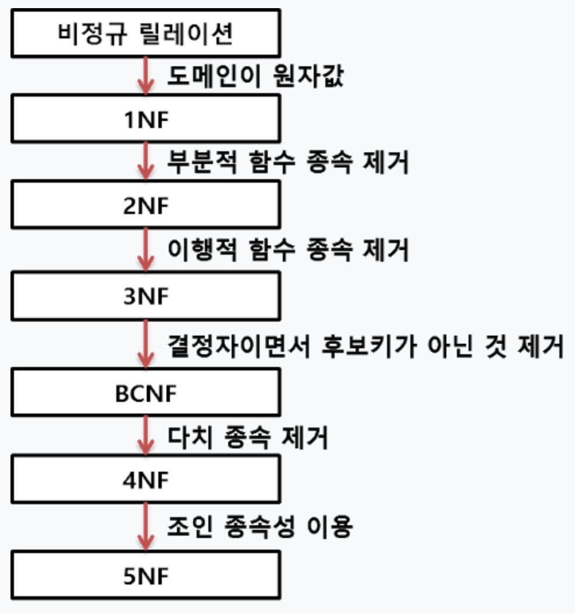

## 🎯핵심 키워드

---
***1.  외래키***

외래키 : FK. 테이블간의 관계를 나타낼때 사용하며, 다른 테이블의 기본키를 참조해 외래키로 사용한다. 즉, 한 테이블의 외래키는 연결되어있는 다른 테이블의 기본키중 하나다.
사실 외래키 설정을 따로 하지 않아도 데이터 조회가 가능하지만, 굳이 하는 이유는 데이터 무결성 때문이다.
무결성: 데이터가 항상 정확한 값을 유지하는 성질
두 테이블중 왼쪽 테이블에서 A가 변경되었는데 오른쪽 테이블의 A가 변경되지 않았다면 문제가 생긴다. 이런 상황을 예방하기 위해 외래키가 존재한다.
---

***2. 기본키***

기본키 : PK. 테이블에서 각 행의 정보들을 식별할 수 있는 정보를 표현한다.
PK는 테이블 행의 여러 정보들 중 행을 식별할 수 있어야 하는 때문에 비어있으면 안되고(NOT NULL) 중복되어서도 안된다(Unique). 그리고 식별을 할 때 테이블의 정보를 최대한 빠르게 검색해야 하므로 간단한 정보일 수록 좋다.
---

***3. ER 다이어그램***

ER 다이어그램 : ERD. 개체 관계 모델링, 관계형 데이터 베이스 설계를 위한 다이어그램을 말한다. 
즉 개체-관계 모델, 테이블간의 관계를 설명해주는 다이어그램이라고 볼 수 있으며 이를 통해 프로젝트에서 사용되는 DB의 구조를 한눈에 파악할 수 있다.
API를 효율적으로 뽑아내기 위한 모델 구조도라고 생각하면 된다.
직사각형, 다이아몬드, 타원형 및 연결선과 같은 정의된 기호 집합을 사용하여 Entity, Relationships 및 해당 속성의 상호 연결성을 나타낸다.
개체를 명사로, 관계를 동사로 사용하여 문법 구조를 반영한다.
---

***4. 복합 키***

복합 키 : 두개 이상의 컬럼을 묶어서 하나의 기본키로 지정하는 것을 말한다.
이때 주의해야할 점은 기본키는 하나의 테이블에 하나만 존재할 수 있으며, 또한 기본키는 하나 이상의 컬럼으로 구성되어 있다.
기본키가 만약 복합키라면, 복합키 또한 당연히 유일성과 최소성을 만족해야한다.
---

***5. 연관관계***

연관관계 : 두 도메인(객체, 테이블) 이 서로 논리적인 의미를 갖고 양쪽을 참조하는 관계를 뜻한다.

 - 연관관계 매핑 시 고려사항
   (1) 방향 (Direction) : 단방향 연관관계, 양방향 연관관계
   (2) 연관관계의 주인 : 양방향 연관관계 매핑시, 반대편 테이블의 외래키를 관리하는 객체.
   (3) 다중성 (Multiplicity) : 다대일(N:1), 일대다(1:N), 일대일(1:1), 다대다(N:M)

---

***6. 정규화***

정규화 : 테이블 간 중복된 데이터를 허용하지 않는 것을 이른다.
중복된 데이터를 허용하지 않음으로써 무결성(Integrity)를 유지할 수 있으며, DB의 저장 용량 역시 줄일 수 있다.

  - 

  총 6가지 단계로 나뉘며 각각의 단계를 거칠 수록 더욱 중복성이 제거되어 데이터를 잘게 쪼갤 수 있다. 너무 제거하는 것 또한 역효과를 낳을 수 있어 보통 1NF ~ 3NF까지 진행하거나 BCNF단계까지 진행한다.

---

***7. 반정규화***

반정규화 : 성능 향상을 위해 정규화된 데이터 모델에서 중복, 통합, 분리 등을 수행하는 모든 과정을 의미한다.
즉, 정규화와 반대되는 과정으로 반정규화를 적용하면 데이터 무결성이 깨질 수 있는 위험이 있지만 데이터를 조회할 때 조인으로 인한 성능저하가 예상될 때 성능이 저하될 것이 예상되는 경우엔 반정규화를 수행한다.

 - 반정규화 기법
   1) 테이블 반정규화
     (1) 테이블 병합 : 1:1 관계 테이블 병합, 1:M 관계 테이블 병합, 슈퍼/서브타입 테이블병합 
     (2) 테이블 분할 : 수직 분할 (하나의 테이블의 속성을 분할하여 두 개 이상의 테이블로 분할), 수평 분할 (하나의 테이블에 있는 값을 기준으로 테이블을 분할)
     (3) 테이블 추가 : 중복 테이블 추가, 통계 테이블 추가, 이력 테이블 추가, 부분 테이블 추가

   2) 속성 반정규화
     (1) 중복 칼럼 추가 : 조인 감소를 위해 중복된 칼럼을 추가
     (2) 파생 칼럼 추가 : 미리 값을 계산하여 칼럼에 보관
     (3) 이력 테이블 칼럼 추가 : 대량의 이력 데이터를 처리할 때 기능성 칼럼(최근값 여부, 시작과 종료일자 등)을 추가
     (4) PK에 의한 칼럼 추가 : 여러 칼럼으로 이루어진 PK를 가진 테이블을 조인할 경우 단순성을 위해서 인공키를 PK로 지정하고 활용
     (5) 응용시스템 오작동을 위한 칼럼 추가 : 이전 데이터를 임시적으로 중복하여 보관

   3) 관계 반정규화
     (1) 중복 관계 추가 : 여러 경로를 거쳐 조인 할 수 있지만, 성능 저하를 예방하기 위해 추가적인 관계를 맺음
---