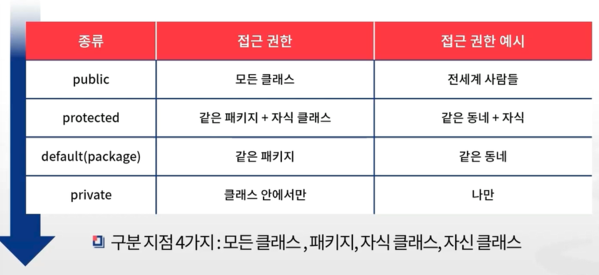

## 🔥 추가과제) 해당 키워드에 대해서 공부한 후 간단정리후 제출 & 면접질문 최소 한개 만들어서 제출 후 스터디 시간에 스터디원들과 질문하기!

---

***1.  자바의 접근제어자 4가지***

클래스 접근 제어자 : 지정된 클래스, 변수, 메서드를 외부에서 접근할 수 있도록 권한을 설정하는 기능

- 1. public : 외부의 모든 클래스에서 접근이 가능한 접근 제어자
- 2. protected : 같은 패키지 내부에 있는 클래스, 하위 클래스(상속받은 경우) 에서 접근이 가능한 접근 제어자. 자기 자신과 상속받은 하위 클래스 둘 다 접근이 가능한 접근 제어자
- 3. default : 접근 제어자를 명시하지 않은 경우로 같은 패키지 내부에 있는 클래스에서 접근이 가능한 접근 제어자
- 4. private : 같은 클래스 내에서만 접근이 가능한 접근 제어자

---

***2. 클래스와 인터페이스***

클래스 : 객체를 정의하고 만들어 내기 위한 설계도 혹은 틀. 클래스 안에는 객체를 만들어내기 위해 필요한 변수와 메서드들이 존재한다.

 - 인스턴스 멤버 : 객체(인스턴스)를 생성한 후 사용할 수 있는 필드와 메서드이다. 이들을 각각 인스턴스 필드, 인스턴스 메서드라고 부른다.

 - 정적 멤버 : 클래스에 고정된 멤버로서, 객체를 생성하지 않고 사용할 수 있는 필드와 메서드이다. 이들을 각각 정적 필드, 정적 메서드라고 부른다. 정적 멤버는 객체가 아닌 클래스에 소속된 멤버이기 때문에 클래스 멤버라고도 한다.

인터페이스의 탄생 목적 : 규격을 정해주기 위해 만들어짐. 일종의 추상 클래스.
 - > 도구의 개념으로 '껍데기'를 만들어준다.
 - > 일상 속 인터페이스의 예로는 c타입 충전기나 이더넷 포트 등이 있음 (외부 규격을 통일해주는 예시들)
 - > 개발자의 업무 속 인터페이스의 예로는 드라이버와 이벤트 리스너가 있음

인터페이스의 정의 규칙
 - 1. 오직 추상 메서드와 상수만을 멤버로 가질 수 있으며, 그 외의 다른 어떠한 요소도 허용하지 않는다.
 - 2. 인터페이스를 상속받을 때에는 일반 상속을 받을 때 사용하는 extends 가 아니라 implements 키워드를 사용한다.
 - 3. class 대신 interface 키워드를 사용한다.

 = > 모든 변수가 public static final, 모든 메서드가 public abstract로 정의된다. (java 8 부터는 static과 default 메서드를 선언할 수 있다.)

인터페이스의 상속
 - extends 가 아니라 implements 키워드를 사용한다.

인터페이스 vs 클래스
 - 인터페이스는 클래스와 다르게 다중 상속이 가능하다.
 - 클래스와 객체 생성 방식은 동일하다.

인터페이스에서 추가된 기능
 - 인터페이스 내의 정적 메서드 정의가 가능하다. (해당 메서드는 어디서나 호출이 가능함)

---

***3. 상속***

상속의 등장 배경 : 비슷한 일, 사용코드를 클래스 단위로 정의 (객체지향 개념) 하여 키워드 extends 만으로 기능을 확장할 수 있도록 하기 위해서 등장.

- 자식 클래스를 생성하면 무조건 부모 클래스의 생성자를 실행한 후에 자식 클래스의 생성자를 실행한다.

- 상속은 물려받는다, 라는 개념보다는 '확장'한다는 개념이 더 맞다.

- 상위 클래스가 하위 클래스를 포함하는 관계가 만족되어야 한다.

- 다중 상속 개념 : 상속(확장) 시, 다중으로 가능.
  - > 현재는 사라진 개념으로, 다중으로 상속해 확장해 나갈시 모호성이 생길 수 있어 없어졌다.

- 상속되는 요소
  필드, 메서드, 이너클래스(클래스 내부에서 선언된 클래스)
  - > 생성자는 상속 불가능
  
---

***4. 면접 질문 만들어보기***

 - Q. 자바에서 상속할 시 상속 불가능한 요소는 무엇인가요?
