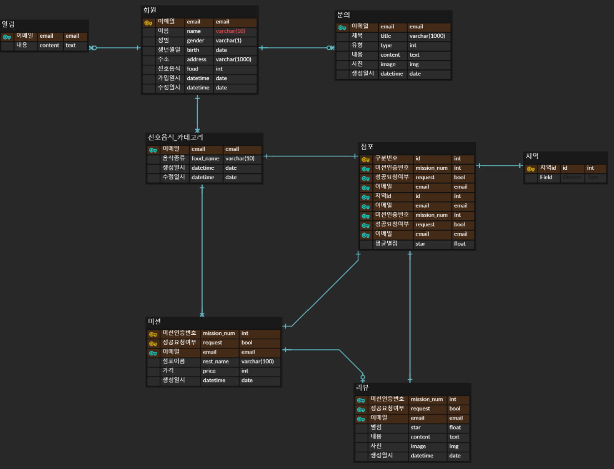

## 🔥 미션

---

- (1) 홈 화면, 마이 페이지 리뷰 작성, 미션 목록 조회(진행중, 진행 완료), 미션 성공 누르기, 회원 가입 하기(소셜 로그인 고려 X) 위의 기능을 구현하는데 필요한 API들을 설계하여 API Endpoint, Request Body, Request Header, query String, Path variable 이 포함된 간단한 명세서를 만들기!

실제 명세서는 Spring Boot 8주차 및 Node.js 9주차, Swagger 설정에서 더 자세히 다룹니다.

***저번 설계 DB***

  - 

***1.  홈 화면***

 - API : /home
 - HEADER : Authorization: Bearer <token>
 - HTTP METHOD : GET
 - RESPONSE BODY : NONE

 GET 요청으로 헤더에 첨부된 토큰을 통해 사용자를 구분한다.

  

---

***2. 마이페이지 리뷰 작성하는 쿼리***

 - > 마이페이지
 - API : /member/mypage
 - HEADER : Authorization: Bearer <token>
 - HTTP METHOD : GET
 - RESPONSE BODY : NONE

url 주소에 userid를 쓰는 방식은 보안상의 위험이 있을 것같다는 생각에 아예 url 자체를 mypage로 통일하고 헤더에 첨부된 토큰으로 사용자를 구분하도록 하였다.

 - > 마이페이지 리뷰 작성
 - API : /member/mypage/{mission_num}
 - HEADER : Authorization: Bearer <token>
 - HTTP METHOD : POST
 - RESPONSE BODY : 

{
	"star": "4.5"
	"content": "맛있었어요~:)",
	"image": "리뷰 첨부 사진 경로",
}

리뷰를 작성할 땐 바디에 미션을 구분하는 id를 추가하는 것이 아니라 url에 추가해 보다 직관적으로 구분이 가능하도록 하였다.

---

***3. 미션 목록 조회 (진행 중, 완료)***

 - > 진행 중인 미션 목록 조회
 - API : /member/mypage/mission?request=false
 - HEADER : Authorization: Bearer <token>
 - HTTP METHOD : GET
 - RESPONSE BODY : NONE

 - > 진행 완료된 미션 목록 조회
 - API : /member/mypage/mission?request=true
 - HEADER : Authorization: Bearer <token>
 - HTTP METHOD : GET
 - RESPONSE BODY : NONE

필드에 request로 선언한 미션 성공 여부 를 가지고 진행 중인 미션과 진행 완료된 미션을 구분하도록 하였다. 진행 중인 미션은 false, 진행 완료된 것은 true 로 각각을 따로 목록화해 가져올 수 있다.
  

---

***4. 미션 성공 처리***

 - API : /member/mypage/mission/{mission_num}
 - HEADER : Authorization: Bearer <token>
 - HTTP METHOD : PATCH
 - RESPONSE BODY : 

{
  "request":"true"
}

성공으로 처리해야 되는 것이므로 성공 여부를 바꾸어주는 api를 만들기 위해 patch 메서드를 선택하였습니다. request 필드로 선언된 성공 여부 (bool 타입) 을 true로 바꾸는 patch api를 통해 바꿀 수 있다.

---

***5. 회원가입***

 - > 회원가입 페이지 전환
 - API : /member/signup
 - HEADER : NONE
 - HTTP METHOD : GET
 - RESPONSE BODY : NONE

  - > 회원가입 페이지 기능
 - API : /member/signup
 - HEADER : NONE
 - HTTP METHOD : POST
 - RESPONSE BODY : 

 {
  	"name":"유저 이름",
  	"gender":"성별",
  	"birth":"0000-00-00",
  	"address":"주소"
    "food":"선호음식"
}

회원가입 페이지로 전환될 때, 그리고 회원가입을 진행할 때에는 더이상 사용자를 구분하는 토큰이 필요하지 않으므로 헤더에서 토큰을 없앴다.

회원 폼에서 필수 항목으로 지정해둔 목록을 response body로 보내 가입할 수 있도록 하였다.

---

