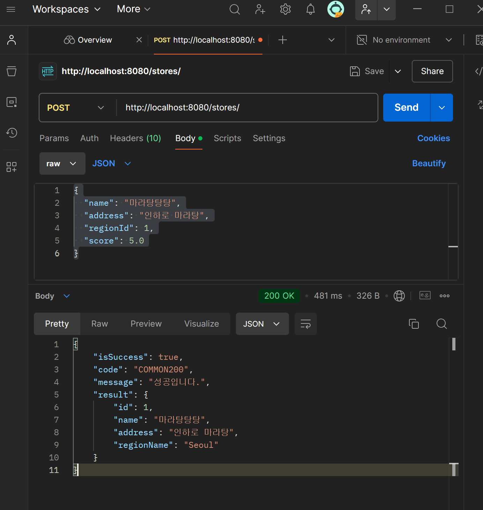

## 🔥 미션

---

- 3주차에 설계한 URL(없으면 추가!)을 바탕으로 아래의 API 구현

***1.  특정 지역에 가게 추가하기 API***

- 

---

***2. 가게에 리뷰 추가하기 API***

- 

---

***3. 가게에 미션 추가하기 API ***

- 
  
---

***4. 가게의 미션을 도전 중인 미션에 추가(미션 도전하기) API***

- 

- 

---

***5. swagger 캡처***

- 

---
  
