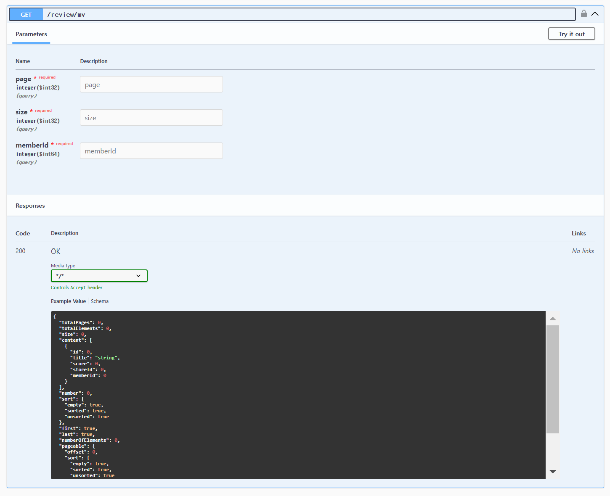
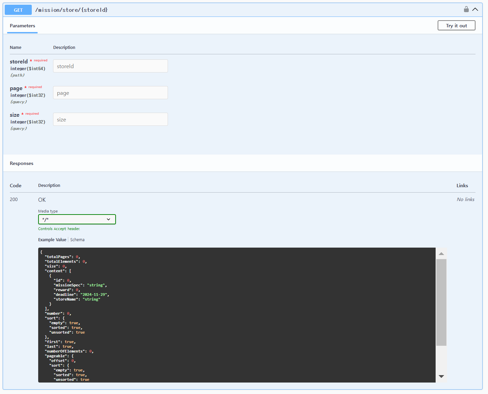
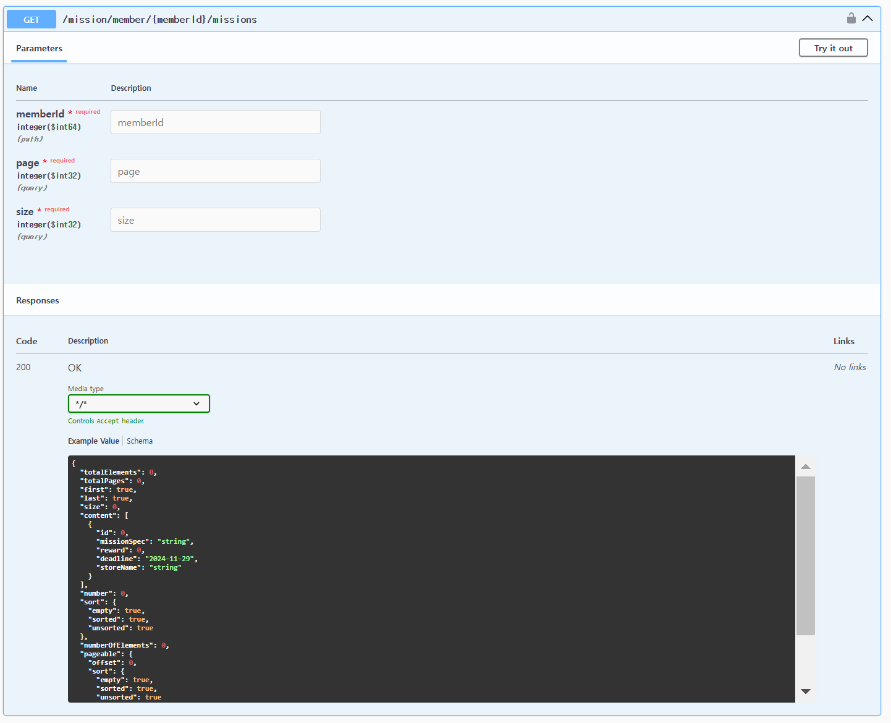
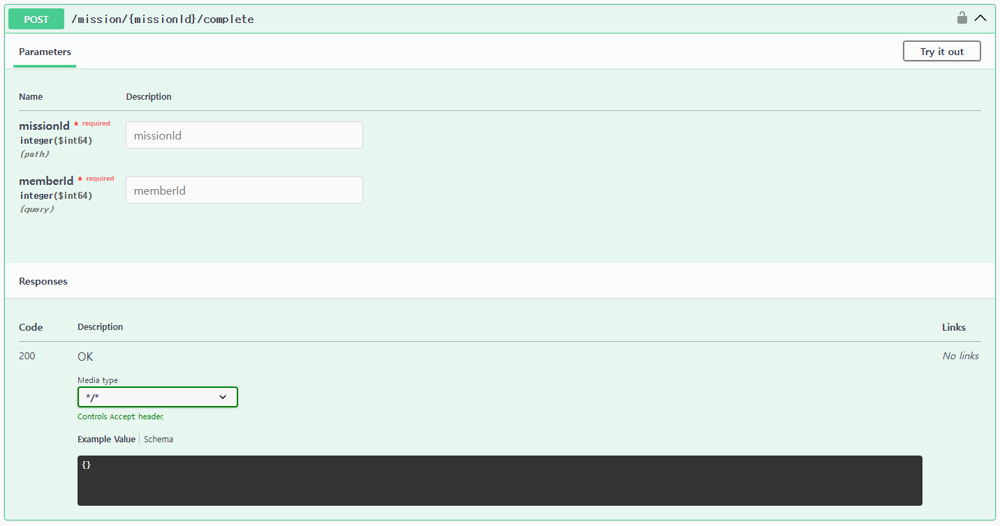

## 🔥 미션

---

- 아래의 API를 구현해야 하며, 추가 조건을 무조건 포함해서 구현

***1.  내가 작성한 리뷰 목록***

- 

---

***2. 특정 가게의 미션 목록***

- 

---

***3. 내가 진행중인 미션 목록***

- 
  
---

***4. 진행중인 미션 진행 완료로 바꾸기***

- 

---

  
